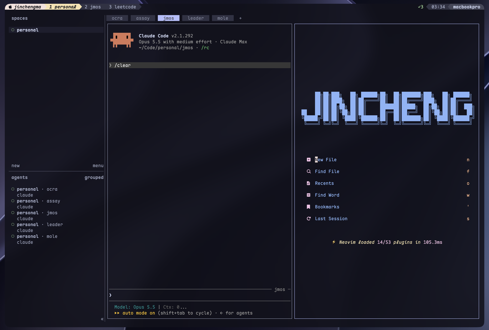
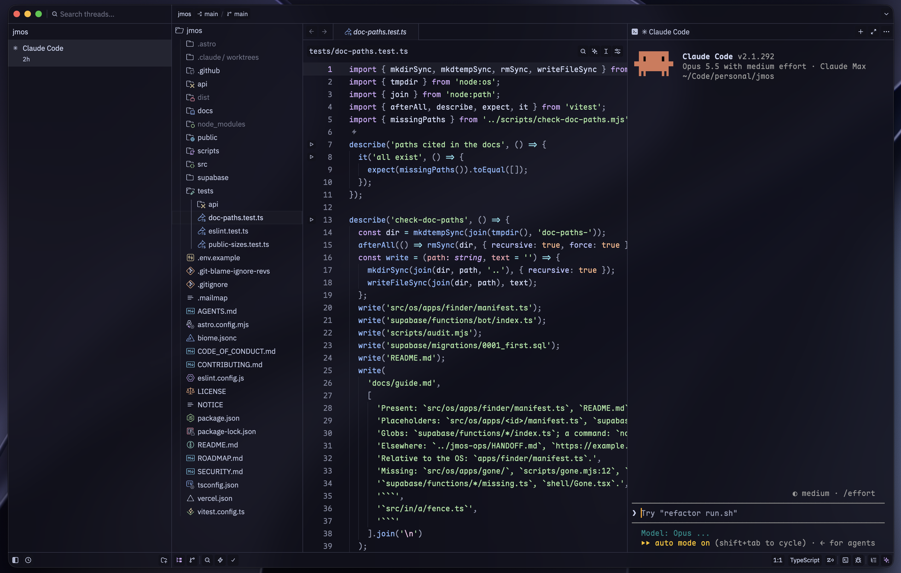
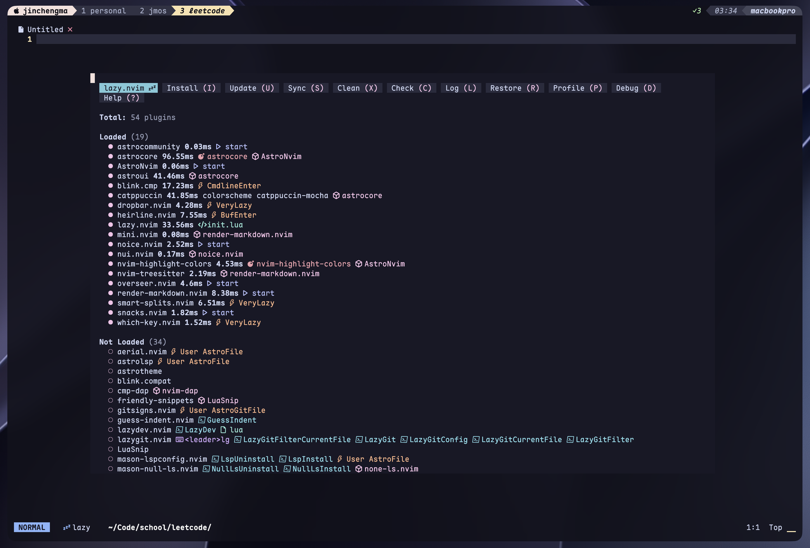
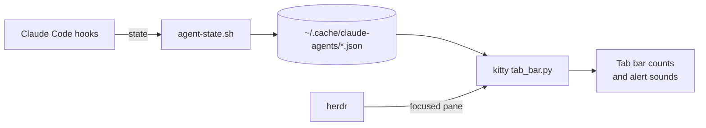

<h1 align="center">dotfiles</h1>

<p align="center">
  A macOS workstation for running many Claude Code agents side by side,<br>
  in Catppuccin Mocha on frosted glass.
</p>

<p align="center">
  <a href="https://github.com/jma49/dotfiles/actions/workflows/lint.yml"></a>
  
  
  
</p>

<p align="center">
  
</p>

## Highlights

- **Built for parallel agents.** kitty hosts [herdr](https://herdr.dev), which keeps Claude Code sessions alive when kitty restarts; kitty's tab bar shows how many need you, are running or have finished, and plays a sound when one needs attention in a pane you aren't watching.
- **One look everywhere.** kitty, herdr, Zed, Neovim, starship, delta, bat, lsd, yazi and fzf share Catppuccin Mocha and the same glass, with dim text lifted so it stays readable over any wallpaper.
- **A theme with receipts.** Zed's *Catppuccin Blur 2.0* is generated from the official palette, with every text color checked for contrast against the glass over both a dark and a bright wallpaper.
- **Checked on every push.** CI lints shell, zsh, Lua, TOML and Python, scans the full history for secrets, verifies the generated theme and stows every package into an empty home.

## Contents

- [Gallery](#gallery)
- [Install](#install)
- [What's inside](#whats-inside)
- [Look](#look)
- [Keys](#keys)
- [Claude Code integration](#claude-code-integration)
- [Checks](#checks)
- [Credits](#credits)

## Gallery

| Zed | Neovim |
| :---: | :---: |
|  |  |

## Install

> [!NOTE]
> Written for Apple Silicon Macs (Homebrew in `/opt/homebrew`).

```bash
git clone https://github.com/jma49/dotfiles.git ~/dotfiles
cd ~/dotfiles && ./install.sh
```

`install.sh` is safe to rerun. It:

1. installs Homebrew if needed and everything in the [`Brewfile`](Brewfile),
2. installs `latex2text` with uv for Neovim's Markdown rendering,
3. moves any existing dotfile it would replace into `~/.dotfiles-backup/<timestamp>/`,
4. links every package into `$HOME` with GNU Stow,
5. installs the Claude Code plugin described [below](#claude-code-integration).

Each top-level directory is a Stow package mirroring `$HOME`, so `kitty/.config/kitty/kitty.conf`
becomes `~/.config/kitty/kitty.conf`. Edit files in the repo; the links pick changes up.

## What's inside

| Package | What it sets up |
| --- | --- |
| [`kitty`](kitty/.config/kitty) | Terminal: Maple Mono NF, glass over Mocha crust (0.88, blur 64), craftzdog-style tab bar with agent status ([`tab_bar.py`](kitty/.config/kitty/tab_bar.py)) |
| [`herdr`](herdr/.config/herdr) | Agent workspace inside kitty: Mocha borders, lavender focus, glass panels, lazygit popup |
| [`zsh`](zsh) | antidote plugins, vi mode with cursor shapes, fzf with previews, zoxide, project jumper |
| [`starship`](starship/.config/starship.toml) | Prompt: dim parent directories, bold repo root, one blue git segment |
| [`zed`](zed/.config/zed) | Settings, keymap and the generated Catppuccin Blur 2.0 themes |
| [`nvim`](nvim/.config/nvim) | AstroNvim v6 on Catppuccin Mocha, tuned for a transparent background |
| [`git`](git) | delta pager (side by side, Catppuccin Mocha), global ignores |
| [`bat`](bat/.config/bat) · [`lsd`](lsd/.config/lsd) · [`yazi`](yazi/.config/yazi) | Catppuccin Mocha for the pager, `ls` and the file manager |
| [`claude`](claude/.claude/dotfiles-plugins) | Claude Code plugin that reports each session's state to the tab bar |

## Look

<p>
  
  
  
  
  
  
  
  
  
</p>

Catppuccin is designed for opaque backgrounds, so a few colors move for glass:

- **The tint is crust, not base.** A darker tint keeps the frost from turning milky and text crisp (craftzdog's Solarized Osaka uses the same trick).
- **Dim text is lifted.** Secondary text in Neovim (file stats, git blame, inlay hints) moves from `surface`/`overlay0` to `overlay2`; Zed adjusts lightness only, never hue.
- **Selection is solid.** An opaque, mid-tone lavender-hue color, solved per flavor to stand out from the glass with text on it at 4.5:1 or better.
- **Accents are shared.** Lavender marks focus (kitty, herdr, Zed borders); the orange cursor matches across kitty and Zed.

**Zed: Catppuccin Blur 2.0.** Six flavors (Latte, Iced Latte, Frappé, Macchiato, Mocha, Espresso),
generated by [`zed/build-catppuccin-blur-2.py`](zed/build-catppuccin-blur-2.py) from catppuccin/zed
at a pinned commit. Edit the script rather than the JSON; bump `OFFICIAL_REF` to follow upstream.

## Keys

<details>
<summary><b>kitty</b></summary>

| Keys | Action |
| --- | --- |
| `cmd+t` / `cmd+w` | New / close tab |
| `cmd+1..9`, `cmd+shift+[` / `]` | Go to tab / previous / next |
| `cmd+d` / `cmd+shift+d` | Split right / down |
| `cmd+shift+h/j/k/l` | Focus pane left / down / up / right |
| `cmd+alt+h/j/k/l` | Resize pane |
| `cmd+shift+m` | Maximize pane |
| `cmd+alt+w` | Close pane |
| `cmd+alt+g` | Toggle grid layout, to watch several agents |
| `cmd+alt+m` | Move pane to another tab |
| `cmd+shift+a` | Open a Claude agent view on the right |
| `cmd+s` · `cmd+p` · `cmd+shift+f` · `cmd+b` | Neovim save · find files · grep · file tree (only while nvim runs) |

Left Option works as Alt; right Option still types special characters.

</details>

<details>
<summary><b>herdr</b> (prefix <code>ctrl+b</code>)</summary>

| Keys | Action |
| --- | --- |
| `prefix y` | lazygit in a popup, in the focused pane's directory |
| `prefix q` | Detach this client; sessions keep running |
| `prefix ?` | Every herdr binding |

</details>

<details>
<summary><b>zsh</b> (vi mode)</summary>

| Keys | Action |
| --- | --- |
| `esc` | Normal mode (block cursor); insert mode shows a beam |
| `alt+j` | Jump to a project in `~/Code`, `~/Code/personal`, `~/.config` or `~/dotfiles` |
| `ctrl+t` / `alt+c` | Pick a file (bat preview) / a directory (tree preview) with fzf |
| `ctrl+r` | Search history with fzf |
| `y` | yazi, landing in the directory you leave it in |

</details>

<details>
<summary><b>Zed</b></summary>

| Keys | Action |
| --- | --- |
| `alt+]` / `alt+[` | Next / previous diff hunk |
| `cmd+alt+d` | Project-wide diff |
| `cmd+shift+a` | Agent panel |
| `cmd+1..9` | Go to editor tab |

</details>

## Claude Code integration



The `agent-status` plugin's hooks record each session as needing you, running, done or failed. The kitty tab
bar reads those files every second, shows the counts and plays a sound when a session needs you in a pane you
aren't looking at. Sessions inside herdr have no kitty window of their own, so the tab bar asks herdr which
pane is focused.

`~/.claude/settings.json` is not managed here: Claude Code rewrites it (plugins, permissions), which would
replace a Stow link with a plain file. `install.sh` installs the plugin when `claude` is available; otherwise:

```bash
claude plugin marketplace add ~/.claude/dotfiles-plugins
claude plugin install agent-status@dotfiles
```

Restart running sessions (or run `/reload-plugins`) to pick it up, and restart kitty after changing `tab_bar.py`.

## Checks

[`lint.yml`](.github/workflows/lint.yml) runs on every push and pull request:

| Check | Tool |
| --- | --- |
| Secrets across the full history | gitleaks, with a [Tavily rule](.gitleaks.toml) added |
| Shell scripts | shellcheck |
| zsh syntax | `zsh -n` |
| Lua formatting | stylua |
| TOML formatting | taplo |
| Python syntax | `py_compile` |
| Zed theme matches its generator | `build-catppuccin-blur-2.py --check` |
| Every package stows into an empty home | GNU Stow |

The same tools come from the `Brewfile`, so they run locally too; run `gitleaks git` before pushing.

## Credits

- [Catppuccin](https://github.com/catppuccin) for the palette and the official themes everything starts from
- [craftzdog/dotfiles](https://github.com/craftzdog/dotfiles) for the darker glass, the Tide-style prompt and the status-line tab bar
- [jenslys/zed-catppuccin-blur](https://github.com/jenslys/zed-catppuccin-blur) for the Zed glass layout and the Iced Latte and Espresso flavors
- [AstroNvim](https://github.com/AstroNvim/AstroNvim) for the Neovim base

## License

[MIT](LICENSE). Catppuccin-derived themes keep their upstream MIT licenses.
